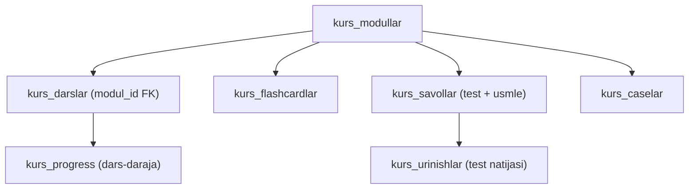

# Reja — Urologiya kurs kontenti va pedagogik model (v2)

> Bu hujjat [REJA-UROLOGIYA-3LEVEL.md](REJA-UROLOGIYA-3LEVEL.md) ustiga quriladi.
> Skelet (34 modul, 126 dars) tuzildi va deploy qilindi. Endi **ichini qanday
> to'ldirish** — pedagogik model, baza, admin va ketma-ketlik.
>
> Muallif g'oyasi: Dr. Arabboyev (2026-09-02). Muhandislik yarashtiruvi: shu hujjat.

## 0. Muammo va yechim

**Xato:** har bir mavzuni alohida "to'liq kurs"ga aylantirish. 126 mavzu × (nazariya
+ video + flashcard + test + USMLE + case + xatolar) = ~700–800 kontent birligi.
Talabada "126 ta og'ir darsni tugatishim kerak" hissi paydo bo'ladi → zeriktiradi.

**Yechim:** formatlarni **darsga emas, to'g'ri pedagogik darajaga** joylashtirish.

> **Dars — bilim beradi. Modul — bilimni mustahkamlaydi. Bosqich — natijani tekshiradi.**

### Qabul qilingan qarorlar (2026-09-02)
| Qaror | Tanlov |
|-------|--------|
| Merge (126 skelet → ~90–95 tartibli asosiy/tanlov dars) | **Men taklif tayyorlayman**, doktor tuzatib tasdiqlaydi (bu hujjat, §10) |
| Baza tuzilmasi | **`kurs_modullar` jadvali + `modul_id`** (normalizatsiya) |
| Boshlanish | **Avval to'liq reja hujjati** (bu). Kod/migratsiya keyin, tasdiqdan so'ng |

---

## 1. Dars / Modul / Bosqich mas'uliyati

| Daraja | Vazifasi | Ichida nima |
|--------|----------|-------------|
| **Dars** | Bilim beradi | Natija · klinik kirish · nazariya · 2–3 tezkor savol · xulosa |
| **Modul** | Bilimni mustahkamlaydi | 2–4 dars + **praktikum** (flashcard, test, USMLE, case) |
| **Bosqich** | Natijani tekshiradi | Yakuniy nazorat + sertifikat |

Barcha darslar bir xil og'irlikda emas. Og'ir formatlar (test bank, USMLE, case)
**modulga** ko'chadi — har darsda takrorlanmaydi.

## 2. Format joylashuvi matritsasi

| Material | Joylashuvi | Chastota |
|----------|------------|----------|
| Nazariya | Har asosiy darsda | 100% |
| Tezkor klinik savol | Har dars oxirida | 2–3 ta |
| Video | Faqat ko'rsatish zarur darsda | ~30–40% darslar |
| Flashcard | **Modul** to'plami | Modulga 10–20 ta |
| Oddiy test | **Modul** oxirida | Modulga 10–15 ta |
| USMLE | **Modul** (Clinical/Advanced) | Modulga 3–5 ta |
| Klinik case | **Modul** oxirida (kasallik moduli) | Modulga 1 ta |
| Interaktiv case | Faqat muhim Clinical/Advanced modul | Shart emas |
| Xatolar tahlili | Test natijasidan **avtomatik** | Qo'lda yozilmaydi |
| Nazorat | **Bosqich** oxirida | Bosqichga 1 ta |
| Sertifikat | Bosqich natijasiga qarab | Foundation'dan tashqari |

## 3. Dars shabloni — 5 qism (10–15 daqiqa)

1. **Dars natijasi** — "talaba nima *qila oladi*?" (2–3 ta amaliy natija)
2. **Klinik kirish** — 30–60 soniyalik vaziyat (maqsad va qiziqish beradi)
3. **Asosiy nazariya** — 5–8 daq, 3–5 kichik sarlavha, 1 ta jadval/sxema/algoritm; "kitob bobi" emas
4. **Klinik tekshiruv** — 2–3 tezkor savol (katta test emas)
5. **Bir daqiqalik xulosa** — 3 asosiy fikr + 1 xavf belgisi + 1 algoritm

## 4. Modul praktikumi

Modul oxirida bitta praktikum — 2–4 darsdan olingan bilim shu yerda birlashadi:
- 10–20 flashcard · 10–15 test · (Clinical/Advanced) 3–5 USMLE · 1 klinik case · "Eng ko'p 5 xato"

Har darsga alohida case/USMLE **yozilmaydi**.

## 5. Advanced — chiziqli emas, yo'nalish (track) modeli

Talaba **49 ta mavjud skelet, 15 ta mavjud modul (20–34) va 1 ta yangi Capstone
modulni** ketma-ket tugatishga majbur bo'lmaydi (jami 16 modul; Capstone mavjud 49
skelet tarkibiga kirmaydi). Advanced **mutaxassislik yo'nalishlariga** bo'linadi:
1. Endourologiya · 2. Uroonkologiya · 3. Andrologiya · 4. Neyro-urologiya · 5. Bolalar urologiyasi

**Advanced sertifikati (hozircha):** majburiy umumiy yadro (**31 — shoshilinch, 34 —
advanced diagnostika, Capstone — "Advanced klinik fikrlash va integrativ case"**) +
**kamida 2 xil trekdan jami kamida 4 ta tanlov moduli**. 30-modul (urologik
onkologiyada umumiy yondashuv) va 21-modul (Advanced BPH) majburiy EMAS — tegishli
track ichida.

> ⚠️ Treklar hajmi teng emas (Uroonkologiya 5 modul · Endourologiya 4 · Andrologiya 2 ·
> Neyro-urologiya 1 · Bolalar 1). Shu sabab "kamida 2 trek" qoidasi hozircha
> **yakuniy emas** — Advanced batafsil merge qilinganda modul hajmi/krediti bo'yicha
> qayta tekshiriladi. Arxitekturada **`kredit`/`sertifikat_ball`** maydoni saqlanadi;
> treklar tenglashsa "trekni to'liq tugatish" qoidasi alohida qo'shilishi mumkin.

## 6. Progress / gating qoidalari (MUHIM tuzatish)

Hozir: testi bo'lmagan dars avtomatik "bajarilgan". Buni o'zgartiramiz.

- **Dars tugadi** ⇐ nazariya oxirigacha ko'rilgan **+** "Darsni tugatdim" bosilgan **+** har darsdagi **3 tezkor savoldan kamida 2 tasi to'g'ri**. Qayta urinish **cheklanmagan**. (Foiz emas — qoida "3 dan 2" tarzida saqlanadi.)
- **Modul tugadi** ⇐ majburiy darslar tugadi **+** modul testi **≥70%** **+** (zarur bo'lsa) case yakunlandi
- **Bosqich tugadi** ⇐ barcha majburiy modullar **+** yakuniy nazorat **≥70%** **+** minimal natija

⚠️ Bu §AGENTS.md sertifikat qoidasini ham hal qiladi: nazorati bo'lmagan modul
sertifikatni arzonlashtirmaydi, chunki gating modul testi/nazoratга bog'lanadi.

---

## 7. Baza sxemasi (normalizatsiya)

Hozirgi `kurs_darslar` da `modul_no`/`modul_nom` har darsda takrorlanadi. Yangi:



### Yangi/o'zgargan jadvallar
- **`kurs_modullar`** — `id, yonalish, bosqich, tartib, nom, maqsad, natijalar[], majburiy(bool), track(text|null), kredit int not null default 1, bepul(bool), daqiqa, ikonka, holat(draft|nashr), sort_order` — `kredit` modul hajmi va Advanced sertifikat talabini (modul soni emas, hajm bo'yicha) hisoblash uchun; alohida `sertifikat_ball` maydoni kerak emas
- **`kurs_darslar`** (mavjud, kengaytiriladi):
  - qo'shiladi: `modul_id` (FK), `tur` ('asosiy'|'bolim'), `dars_natijalari[]`, `klinik_kirish`, `xulosa`, `tezkor_savollar` (jsonb — 2–3 savol), `bepul_namuna`, `holat`
  - `modul_no`/`modul_nom` — migratsiyada `kurs_modullar` ga ko'chiriladi, keyin eskirtiriladi (darrov o'chirmaymiz — orqaga moslik)
- **`kurs_flashcardlar`** — `id, modul_id, old, yangi, kategoriya, sort_order`
- **`kurs_savollar`** — `id, modul_id, tur ('test'|'usmle'), savol, variantlar[], togri, izoh, notogri_izoh(jsonb), qayta_kor_dars_slug, xato_kategoriya`
- **`kurs_caselar`** — `id, modul_id, sarlavha, bosqichlar(jsonb — interaktiv qadamlar)`
- **`kurs_progress`** — `student_id, dars_id, korildi(bool), tugatdim(bool), tezkor_foiz, updated_at`
- **`kurs_urinishlar`** — `student_id, modul_id, tur, ball, jami, foiz, javoblar(jsonb), created_at`
- **`kurs_xatolar`** — **saqlanmaydi**, `kurs_urinishlar.javoblar` dan avtomatik hisoblanadi (kuchsiz mavzu, takror xato, qayta ko'rish darsi)

Migratsiya orqaga mos: `kurs_modullar` ni mavjud 126 qatordan distinct `(yonalish,bosqich,modul_no,modul_nom)` bo'yicha to'ldiramiz, so'ng darslarga `modul_id` backfill.

## 8. Admin qayta tuzilishi — 3 muharrir

Hozirgi bitta forma har darsga bir xil maydon beradi. Uni ajratamiz:

**A. Modul muharriri** — yo'nalish, bosqich, tartib, nom, maqsad, natijalar, majburiy/tanlov, track, bepul/pullik, daqiqa, ikonka, holat.

**B. Dars muharriri** — modul (tanlov), nom, slug, natijalar, klinik kirish, nazariya, sxema/jadval, video, 2–3 tezkor savol, xulosa, daqiqa, bepul namuna, tur (asosiy/bo'lim), holat.

**C. Modul praktikumi** — tablar: Flashcard · Test · USMLE · Case · Nazorat · Xatolar xaritasi. Egasi — modul.

**Modul tayyorlik o'lchagichi** (admin ko'radi):
```
Nazariya 4/4 ✅ · Video 2/4 ✅ · Tezkor savol 4/4 ✅
Flashcard 15/15 ✅ · Modul testi 10/10 ✅ · Case 1/1 ✅
Modul tayyorligi: 100%   [Draft → Nashr]
```
Video mezoni oldindan belgilanadi (har darsda majburiy emas).

**Admin ish jarayoni (modul yaratish):** maqsad → 2–4 dars → nazariya+tezkor savol → zarur darsga video → flashcard to'plami → modul testi → (Clinical/Advanced) case/USMLE → "talaba ko'rinishida ko'rish" → draft'dan nashrga.

## 9. Talaba interfeysi

Ikkita teng "Eski/Yangi" karta uzoq turmaydi (raqobat taassuroti beradi). Yakuniy:

- **Asosiy karta:** "Urologiya kursi" — joriy bosqich, joriy modul, umumiy progress, **Davom ettirish**
- **Pastdagi bo'limlar:** Foundation · Clinical · Advanced yo'nalishlar · Test va case'lar · **Qo'shimcha materiallar / Arxiv** (eski darslar bu yerga)

**Modul kartasi** (yopiq):
```
09-modul · Urolitiaz
4 dars • 55 daqiqa • 60% bajarildi
```
Ochilganda darslar chiqadi (✓ tugagan / ▶ joriy / 🔒 qulf) + [Modul praktikumi]. Har dars kartasida funksiya ro'yxati takrorlanmaydi.

---

## 10. Merge taklifi — 126 skelet → ~90–95 tartibli asosiy/tanlov dars

Har skeletga teg: `asosiy` (alohida dars) · `bolim` (boshqa darsning bo'limi) ·
`praktikum` (modulga) · `tanlov` (Advanced) · `arxiv` · `takror`.
Quyida **Foundation + Clinical to'liq** (har dars → eski sluglar), Advanced — track + majburiy yadro (dars-daraja merge o'sha faza'da).

### 🟢 FOUNDATION — 35 skelet → 21 asosiy dars *(doktor tasdiqi, 2026-09-02)*

| Modul | # | Asosiy dars | Birlashgan skeletlar |
|-------|---|-------------|----------------------|
| 1 | 1 | **Urologiya, yo'nalishlari va urolog–nefrolog farqi** | urologiya-nima, urologiya-yonalishlari, urolog-nefrolog-farqi |
| 1 | 2 | **Urologik yordam turlari va anatomiyaning klinik ahamiyati** | urologik-davolash-turlari, urologik-anatomiya-ahamiyat |
| 2 | 3 | **Buyrakning tuzilishi va topografiyasi** | buyrak-anatomiyasi, buyrak-topografiyasi |
| 2 | 4 | **Buyrak qon ta'minoti va klinik ahamiyati** | buyrak-qon-taminoti |
| 2 | 5 | **Nefronning soddalashtirilgan tuzilishi va vazifasi** | buyrak-gistologiyasi, siydik-hosil-bolishi |
| 3 | 6 | **Yuqori siydik yo'llari: buyrak jomi va ureter** | ureter-anatomiyasi |
| 3 | 7 | **Pastki siydik yo'llari: siydik pufagi va uretra** | siydik-pufagi-anatomiyasi, uretra-anatomiyasi |
| 4 | 8 | **Siydik pufagining to'lishi va saqlash fazasi** | mikturitsiya-nima, pufak-tolishi |
| 4 | 9 | **Siyish refleksi, bo'shatish fazasi va sog'lom siyish** | siyish-refleksi, siyish-nerv-boshqaruvi, soglom-siyish |
| 5 | 10 | **Moyak, epididimis va urug' yo'llari** | moyak-anatomiyasi, epididimis-vas-deferens |
| 5 | 11 | **Spermatogenez va gormonal boshqaruv asoslari** | spermatogenez, testosteron-fiziologiyasi |
| 5 | 12 | **Prostata, urug' pufakchalari va yordamchi bezlar** | prostata-asoslari, urug-pufakchalari |
| 5 | 13 | **Jinsiy olat anatomiyasi** | jinsiy-olat-anatomiyasi |
| 6 | 14 | **Urologik anamnez va umumiy fizik ko'rik** | urologik-anamnez, urologik-fizik-korik¹ |
| 6 | 15 | **Mahalliy urologik ko'rik va DRE** | dre-asoslari, urologik-fizik-korik¹ |
| 6 | 16 | **Asosiy laborator tekshiruvlarni tanlash** | urologik-laborator-tekshiruvlar |
| 6 | 17 | **Urologik tasviriy tekshiruvlarni tanlash** | urologik-tasvirlash-kirish |
| 7 | 18 | **Siyish bilan bog'liq simptomlar** | siydik-simptomlari |
| 7 | 19 | **Siydikdagi patologik o'zgarishlar** | siydik-patologik-ozgarishlari |
| 7 | 20 | **Urologik og'riq** | urologik-ogriq |
| 7 | 21 | **Erkak jinsiy simptomlari** | erkak-jinsiy-simptomlar |

¹ `urologik-fizik-korik` ikkiga bo'linadi: umumiy qism → 14-dars, mahalliy qism → 15-dars.

**Foundation yakuni: 21 asosiy dars.** 5-modul (reproduktiv) 4 dars — testosteron
spermatogenez/moyak funksiyasi bilan bog'lanadi, jinsiy olat alohida. 6-modul
(tekshiruvlar) 4 dars — laborator va tasviriy alohida qoladi.

**Gistologiya (aniqlik):** Foundation'da nefronning **soddalashtirilgan** tuzilishi va
siydik hosil bo'lishining umumiy mexanizmi qoladi (5-dars). JGA, RAAS va chuqur
mikroskopik tafsilotlar **avtomatik ravishda Clinical'ga majburiy dars sifatida
ko'chirilmaydi** — ular nefrologiya/fiziologiyaga yaqin; zarur qismlari tegishli
klinik dars ichida yoki "Qo'shimcha material" sifatida beriladi.

### 🟡 CLINICAL — 42 skelet → 37 asosiy dars *(doktor taqsimoti, 2026-09-02)*

**Shartlar (doktor):** ① farqli kasalliklar faqat sonni kamaytirish uchun birlashtirilmaydi ·
② diagnostika+davolash bitta klinik algoritm ichida bo'lishi mumkin ·
③ sistit, pielonefrit, o'tkir siydik tutilishi (AUR), gematuriya, urosepsis boshqa mavzu ichida yo'qolmasin ·
④ asosiy mezon dars soni emas — bitta dars 10–15 daq da bitta aniq klinik natija bersin.

| Modul | # | Asosiy dars | Birlashgan sluglar |
|-------|---|-------------|--------------------|
| 8 SYI | 1 | UTI tasnifi va klinik yondashuv | uti-asoslari |
| 8 SYI | 2 | Sistit | sistit |
| 8 SYI | 3 | Uretrit | uretrit |
| 8 SYI | 4 | Pielonefrit | pielonefrit |
| 8 SYI | 5 | UTI diagnostikasi, davolash tamoyillari va murakkab UTI | uti-diagnostika-davolash |
| 9 Urolitiaz | 6 | Toshlar: turlari va hosil bo'lish mexanizmi | siydik-toshi-turlari, tosh-hosil-mexanizmi |
| 9 Urolitiaz | 7 | Buyrak sanchig'i (renal kolika) va klinika | renal-kolika |
| 9 Urolitiaz | 8 | Tosh diagnostikasi | tosh-diagnostika |
| 9 Urolitiaz | 9 | Davolash va profilaktika | tosh-davolash-asoslari, tosh-profilaktika |
| 10 BPH | 10 | BPH va LUTS | bph-etiologiya, bph-luts |
| 10 BPH | 11 | Diagnostika (IPSS/PSA/uroflow/PVR) | bph-diagnostika |
| 10 BPH | 12 | Davolash | bph-davolash |
| 11 Prostatit | 13 | O'tkir bakterial prostatit | otkir-bakterial-prostatit |
| 11 Prostatit | 14 | Surunkali prostatit va CPPS | surunkali-prostatit |
| 11 Prostatit | 15 | Diagnostika va davolash | prostatit-diagnostika-davolash |
| 11 Prostatit | 16 | Prostatit vs BPH vs prostata saratoni | prostatit-bph-ca-differensial |
| 12 LUTS | 17 | LUTS va tutolmaslik turlari | luts-tasnifi, siydik-tutolmaslik-turlari |
| 12 LUTS | 18 | Diagnostika va davolash | tutolmaslik-diagnostika-davolash |
| 13 Tutilishi | 19 | O'tkir siydik tutilishi (AUR) | otkir-siydik-tutilishi |
| 13 Tutilishi | 20 | Surunkali siydik tutilishi | surunkali-siydik-tutilishi |
| 13 Tutilishi | 21 | Kateterizatsiya asoslari | kateterizatsiya-asoslari |
| 14 Torayishlar | 22 | Uretra torayishi (stricture) | uretra-torayishi |
| 14 Torayishlar | 23 | Ureter obstruksiyasi | ureter-obstruksiyasi |
| 15 Jinsiy disf. | 24 | Erektil disfunksiya (sabab, diagnostika, davolash) | erektil-disfunksiya, ed-diagnostika-davolash |
| 15 Jinsiy disf. | 25 | Ejakulyatsiya buzilishlari | ejakulyatsiya-buzilishlari |
| 16 Scrotal | 26 | Varikotsele | varikotsele |
| 16 Scrotal | 27 | Gidrotsele | gidrotsele |
| 16 Scrotal | 28 | Epididimit va orxit | epididimit-orxit |
| 17 Gematuriya | 29 | Gematuriya: turlari | gematuriya-turlari |
| 17 Gematuriya | 30 | Gematuriya: diagnostik algoritm | gematuriya-algoritm |
| 18 Travma | 31 | Buyrak travmasi | buyrak-travmasi |
| 18 Travma | 32 | Ureter va siydik pufagi travmasi | ureter-pufak-travmasi |
| 18 Travma | 33 | Uretra va genital travma | uretra-genital-travma |
| 19 Bolalar | 34 | Kriptorxizm | kriptorxizm-kirish |
| 19 Bolalar | 35 | Gipospadiya | gipospadiya-kirish |
| 19 Bolalar | 36 | Fimoz | fimoz-kirish |
| 19 Bolalar | 37 | VUR va gidronefroz | vur-gidronefroz-kirish |

**Clinical yakuni: 37 asosiy dars.** Diagnostika+davolash birlashgan darslar (9-modul davolash+profilaktika, 15-modul ED) 10–15 daq dan oshsa, ajratiladi.

### 🔴 ADVANCED — 15 modul (20–34) + 1 capstone; ~35 darslik kutubxona

**Majburiy yadro** (Advanced sertifikati uchun barcha talabalarga):
- **31** — Urologik shoshilinch holatlar
- **34** — Advanced urologik diagnostika
- **Capstone (yangi modul)** — "Advanced klinik fikrlash va integrativ case"

**Tanlov tracklar** (sertifikat uchun ≥2 xil trekdan jami ≥4 tanlov moduli). Har modul faqat bitta joyda:

| Track | Modullar |
|-------|----------|
| **Endourologiya** | 20 (murakkab urolitiaz), 21 (Advanced BPH), 25 (yuqori yo'llar), 33 (minimal invaziv tex) |
| **Uroonkologiya** | 22 (prostata Ca), 23 (buyrak), 24 (pufak), 29 (moyak), **30 (urologik onkologiyada umumiy yondashuv)** |
| **Andrologiya** | 27 (bepushtlik), 28 (gormonal) |
| **Neyro-urologiya** | 26 |
| **Bolalar (advanced)** | 32 |

**Tuzatishlar (doktor):** 30-modul = "urologik onkologiyada umumiy klinik **yondashuv**"
(barcha track uchun majburiy emas) → Uroonkologiya trekida qoladi. 21-modul majburiy emas.
Majburiy yadrodagi modul (31, 34) alohida tanlov treki sifatida **ikki marta hisoblanmaydi**.
Advanced dars-daraja merge (masalan 22-modul 5→4) **o'sha faza'da** yakunlanadi.

**Yakuniy sanoq:** 126 skelet → **taxminan 90–95 ta tartibli asosiy/tanlov dars**
(F=21 · C=37 · Advanced kutubxonasi ≈35).

**Majburiy yo'l — sertifikat bo'yicha alohida:**
- **Foundation yakuni:** 21 dars
- **Clinical sertifikati:** jami **58 dars** (Foundation 21 + Clinical 37)
- **Advanced sertifikati:** 58 dars + Advanced majburiy yadro (31, 34, Capstone) + belgilangan tanlov modullari (≥2 xil trekdan ≥4 modul)

---

## 11. Build ketma-ketligi *(merge tasdiqlash — muzlatishdan OLDIN)*

1. **Foundation va Clinical merge xaritasini yakunlash** — §10 (F=21 ✅, C=37 ✅ doktor tasdiqi)
2. **Kontent modeli va majburiy/tanlov yo'llarini tasdiqlash** — dars shabloni (5 qism), modul praktikumi, Advanced yadro+tracklar
3. **Arxitekturani muzlatish** — sxema, gating, admin/talaba modeli qat'iylashadi
4. **Migratsiya va admin skeleti** — `kurs_modullar` + `modul_id` + praktikum/progress jadvallari; admin 3-muharrir; talaba modul-karta + praktikum
5. **Pilot modul (SYI, 8-modul)** — 5 dars + flashcard + test + 1 case + progress — admindan talabagacha to'liq
6. **Pilot sinovi** — dars vaqti, zerikish nuqtasi, tark etish, test natijasi, ishlatilmagan material, mobil qulaylik
7. **Bosqichma-bosqich kontent** — Foundation → Clinical (kasallik bo'yicha) → Advanced (paketlar: Endourologiya → Uroonkologiya → …)

## 12. Hozirgi koddan nima o'zgaradi

- `kurs_darslar` — `modul_id` + shablon ustunlari qo'shiladi; `modul_no/modul_nom` eskiradi
- `/admin/urologiya-darslar` — bitta forma → 3 muharrir (modul / dars / praktikum)
- `/student/urologiya/darslar/bosqich/[b]` — modul akkordeoni saqlanadi, lekin modul manbai `kurs_modullar`; darsda praktikum tugmasi
- Viewer — 5-qism shabloni; test darsdan **modul praktikumiga** ko'chadi
- Progress — `kurs_natijalar` (dars test) → `kurs_progress` + `kurs_urinishlar` (modul); gating kuchayadi
- Dashboard — 2 karta o'rniga 1 asosiy "Urologiya kursi" + bo'limlar; "Eski darslar" → "Arxiv"

## 13. Qarorlar — YOPILGAN *(doktor, 2026-09-02)*
1. **Pullik gate:** L2/L3 hozircha mavjud `tariflar` (obuna) bilan. Modul-darajali alohida sotuv hozir qo'shilmaydi. Kelajakda Advanced tracklarni alohida paket sifatida sotish imkoni saqlanadi.
2. **Foundation gistologiya:** Foundation'da nefronning soddalashtirilgan tuzilishi va siydik hosil bo'lishining umumiy mexanizmi qoladi (5-dars). Chuqur gistologiya, JGA va RAAS **alohida majburiy Clinical darsga aylantirilmaydi**; zarur qismlari tegishli klinik darslarda yoki qo'shimcha material sifatida beriladi.
3. **Tezkor savol:** har darsda 3 savol, **kamida 2 tasi to'g'ri** (foiz bilan emas, "3 dan 2" qoidasi) → dars yakunlangan; qayta urinish cheklanmagan. Modul testi va yakuniy nazorat = 70%.
4. **Advanced majburiy yadro:** Advanced sertifikati uchun **31-modul, 34-modul va Capstone majburiy**; qo'shimcha ravishda **kamida 2 xil trekdan jami kamida 4 ta tanlov moduli** bajariladi. Bu qoida Advanced batafsil merge qilinganda kreditlar asosida qayta tekshiriladi. 30-modul ("urologik onkologiyada umumiy yondashuv") va 21-modul majburiy emas — tegishli trekda. Advanced = 20–34 oralig'ida **15 modul** + Capstone (jami 16). Majburiy modul tanlov treki sifatida ikki marta hisoblanmaydi. Tracklar: Endourologiya · Uroonkologiya · Andrologiya · Neyro-urologiya · Bolalar (advanced).
